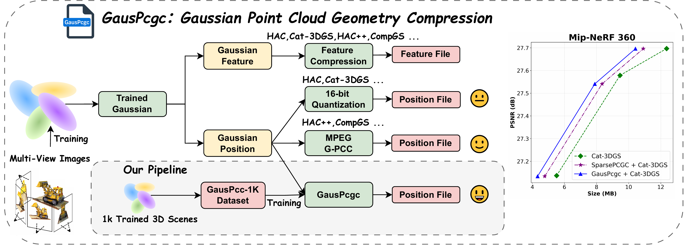

<h1 align="center">A Novel Benchmark and Dataset for Efficient 3D Gaussian Splatting with Gaussian Point Cloud Compression </h1>

<p align="center">
    <strong>Kangli Wang</strong><sup>1</sup>, <strong>Shihao Li</strong><sup>1</sup>,<strong>Qianxi Yi</strong><sup>1,2</sup>,<strong>Wei Gao</strong><sup>1,2*</sup><br>
    (<em>* Corresponding author</em>)
</p>

<p align="center">
    <sup>1</sup>SECE, Peking University<br>
    <sup>2</sup>Peng Cheng Laboratory, Shenzhen, China
</p>

## 📣 News
- [25-05-22] We initially released code and paper.

## Todo
- [x] ~~Release Paper~~ 
- [x] ~~Release the example code~~
- [x] ~~Release checkpoint~~
- [ ] Release Dataset

## Links
Our additional work on point cloud compression has also been released. Welcome to check it.
- [UniPCGC](https://github.com/yihangchen-ee/hac/) [AAAI'25]: A unified point cloud geometry compression. [[`Paper`](https://ojs.aaai.org/index.php/AAAI/article/view/33387)] [[`Arxiv`](https://arxiv.org/abs/2503.18541)] [[`Project`](https://uni-pcgc.github.io/)]


## 📌 Introduction

Recently, immersive media and autonomous driving applications have significantly advanced through 3D Gaussian Splatting (3DGS), which offers high-fidelity rendering and computational efficiency. Despite these advantages, 3DGS as a display-oriented representation requires substantial storage due to its numerous Gaussian attributes. Current compression methods have shown promising results but typically neglect the compression of Gaussian spatial positions, creating unnecessary bitstream overhead.
We conceptualize Gaussian primitives as point clouds and propose leveraging point cloud compression techniques for more effective storage. AI-based point cloud compression demonstrates superior performance and faster inference compared to MPEG Geometry-based Point Cloud Compression (G-PCC). However, direct application of existing models to Gaussian compression may yield suboptimal results, as Gaussian point clouds tend to exhibit globally sparse yet locally dense geometric distributions that differ from conventional point cloud characteristics.
To address these challenges, we introduce GausPcgc for Gaussian point cloud geometry compression along with a specialized training dataset GausPcc-1K. Our work pioneers the integration of AI-based point cloud compression into Gaussian compression pipelines, achieving superior compression ratios. The framework complements existing Gaussian compression methods while delivering significant performance improvements. All code, data, and pre-trained models will be publicly released to facilitate further research advances in this field.

<div align="center">

<br>
Ilustration of the proposed framework. 
</div>

## 🔑 Setup
Type the command for general installation
```
git clone https://github.com/Wangkkklll/GausPcc.git
conda create -n gauspcc python=3.8
pip install -r requirements
cd src/gs_compress/HAC/submodules
unzip diff-gaussian-rasterization.zip
unzip gridencoder.zip
unzip simple-knn.zip
unzip arithmetic.zip
cd ../..
pip install -e HAC/submodules/diff-gaussian-rasterization
pip install -e HAC/submodules/simple-knn
pip install -e HAC/submodules/gridencoder
pip install -e HAC/submodules/arithmetic
```

## 🧩 Dataset Preparation (Coming Soon)
Please refer to the following links to obtain the data.
| Datasets | Download Link | 
|:-----: |:-----: |
| Testset | [Link](#)  |
| GausPcc-1K | [Link](#)  |

## 🚀 Running
For train our point cloud compreesion framework
```
./scripts/ai_pcc/run_train_gauspcgc.sh
```
run the following code for train Our-HAC gaussian compression
```
./scripts/gs_compress/run_ours_hac.sh
```

## 💪 Integration with More Frameworks


### General Steps

1. **Copy Required Files**:
   - Copy `GausPcgc/` directory to your framework
   - Copy `HAC/utils/pcc_utils.py` to your framework's utility directory

2. **Modify Gaussian Model**:
   - Locate the file in your framework that handles Gaussian anchor points
   - Add the AI-PCC compression during encoding and decoding phases

3. **Update Import Paths**:
   - Ensure the import paths in `pcc_utils.py` are updated to match your project structure

### Example Modifications

For most frameworks, you'll need to modify the encoding and decoding processes similar to how we modified HAC's `gaussian_model.py`:

### Encoding Phase
```python
# Import necessary functions
from utils.pcc_utils import calculate_morton_order, compress_point_cloud

# During anchor point processing
_anchor_int = torch.round(_anchor / voxel_size)
sorted_indices = calculate_morton_order(_anchor_int)
_anchor_int = _anchor_int[sorted_indices]
npz_path = os.path.join(output_path, 'xyz_pcc.bin')
model_path = os.path.join(model_dir, 'best_model_ue_4stage_conv.pt')
out = compress_point_cloud(_anchor_int, model_path, npz_path)
bits_xyz = out['file_size_bits']
```

### Decoding Phase
```python
# Import necessary functions
from utils.pcc_utils import calculate_morton_order, decompress_point_cloud

# During anchor point reconstruction
npz_path = os.path.join(input_path, 'xyz_pcc.bin')
model_path = os.path.join(model_dir, 'best_model_ue_4stage_conv.pt')
anchor_decoded = decompress_point_cloud(npz_path, model_path)

_anchor_int_dec = anchor_decoded['point_cloud'].to('cuda')
sorted_indices = calculate_morton_order(_anchor_int_dec)
_anchor_int_dec = _anchor_int_dec[sorted_indices]
anchor_decoded = _anchor_int_dec * voxel_size
```


## 🔎 Contact
If your have any comments or questions, feel free to contact [kangliwang@stu.pku.edu.cn](kangliwang@stu.pku.edu.cn).

## 👍 Acknowledgement
- We thank all authors from [3D-GS](https://github.com/graphdeco-inria/gaussian-splatting) and [Scaffold-GS](https://github.com/city-super/Scaffold-GS) for their excellent work.
- We thank all authors from [HAC](https://github.com/YihangChen-ee/HAC), [Cat-3DGS](https://github.com/NYCU-MAPL/CAT-3DGS), [HAC++](https://github.com/YihangChen-ee/HAC-plus), [TC-GS](https://github.com/timwang2001/TC-GS) and more for their excellent compression framework.
- We thank all authors from [DL3DV-10K](https://github.com/DL3DV-10K/Dataset) for their excellent NVS dataset work.
- We thank all authors from [RENO](https://github.com/NJUVISION/RENO), [SparsePCGC](https://github.com/NJUVISION/SparsePCGC), [Octattention](https://github.com/zb12138/OctAttention), [EHEM](https://openaccess.thecvf.com/content/CVPR2023/papers/Song_Efficient_Hierarchical_Entropy_Model_for_Learned_Point_Cloud_Compression_CVPR_2023_paper.pdf) for their excellent point cloud compression work.


## 📘 Citation
Please consider citing our work as follows if it is helpful.
```bibtex
@article{}
```