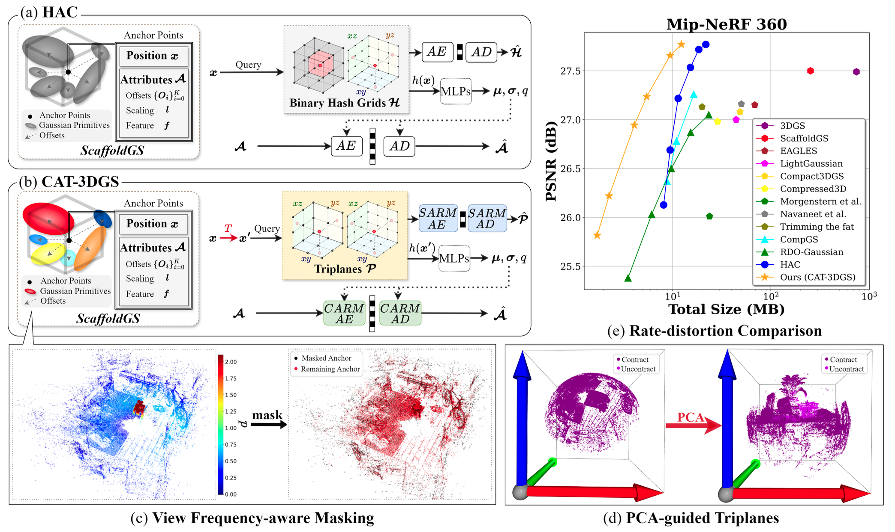
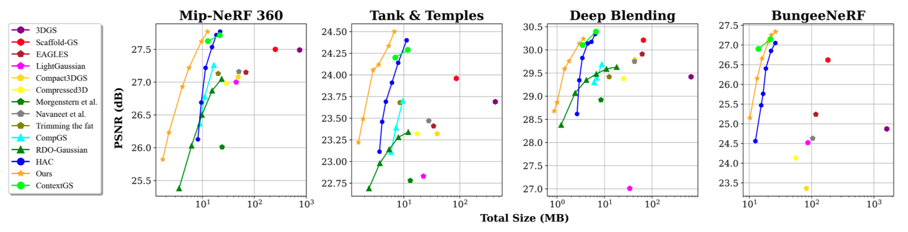

# CAT-3DGS: A Context-Adaptive Triplane Approach to Rate-Distortion-Optimized 3DGS Compression

Accpeted to ICLR 2025

[Yu-Ting Zhan*](https://www.linkedin.com/in/yu-ting-zhan-233784328/), 
[Cheng-Yuan Ho*](https://www.linkedin.com/in/kelvincyho?utm_source=share&utm_campaign=share_via&utm_content=profile&utm_medium=ios_app), 
[Hebi Yang](https://www.linkedin.com/in/hebiyang?utm_source=share&utm_campaign=share_via&utm_content=profile&utm_medium=android_app ), 
[Yi-Hsin Chen](https://www.linkedin.com/in/yihsinchen/), 
[Jui Chiu Chiang](https://chiang.ccu.edu.tw/p/404-1255-68777.php?Lang=zh-tw), 
[Yu-Lun Liu](https://yulunalexliu.github.io/), 
[Wen-Hsiao Peng](https://sites.google.com/g2.nctu.edu.tw/wpeng)

[[`Arxiv`](https://arxiv.org/abs/2503.00357)] [[`Project Page`](https://nycu-mapl.github.io/CAT-3DGS_page/)] [[`Github`](https://github.com/NYCU-MAPL/CAT-3DGS)]


## Abstract
<p align="left">

</p>

CAT-3DGS introduces a context-adaptive triplane approach to their rate-distortion-optimized coding. It features multi-scale triplanes, oriented according to the principal axes of Gaussian primitives in the 3D space, to capture their inter correlation (i.e. spatial correlation) for spatial autoregressive coding in the projected 2D planes. With these triplanes serving as the hyperprior, we further perform channel-wise autoregressive coding to leverage the intra correlation within each individual Gaussian primitive. Our CAT-3DGS incorporates a view frequency-aware masking mechanism. It actively skips from coding those Gaussian primitives that potentially have little impact on the rendering quality. When trained end-to-end to strike a good rate-distortion trade-off, our CAT-3DGS achieves the state-of-the-art compression performance on the commonly used real-world datasets.

## Performance
<p align="left">

</p>


## Installation

We tested our code on a server with Ubuntu 20.04.1, cuda 11.8, gcc 9.4.0
1. Unzip files
```
cd submodules
unzip diff-gaussian-rasterization.zip
unzip simple-knn.zip
cd ..
```
2. Install environment
```
conda env create --file environment.yml
conda activate CAT3DGS
```
3. Set your comet key
(train.py, line 726)
```
with open("path/to/your/comet_keys.json", 'r') as f:
```
## Data

First, create a ```data/``` folder inside the project path by 
```
mkdir data
```

The data structure will be organised as follows:

```
data/
├── dataset_name
│   ├── scene1/
│   │   ├── images
│   │   │   ├── IMG_0.jpg
│   │   │   ├── IMG_1.jpg
│   │   │   ├── ...
│   │   ├── sparse/
│   │       └──0/
│   ├── scene2/
│   │   ├── images
│   │   │   ├── IMG_0.jpg
│   │   │   ├── IMG_1.jpg
│   │   │   ├── ...
│   │   ├── sparse/
│   │       └──0/
...
```

 - For instance: `./data/bungeenerf/amsterdam/`
 - For instance: `./data/mipnerf360/bicycle/`
 - For instance: `./data/tandt/train/`


### Public Data (We follow suggestions from [Scaffold-GS](https://github.com/city-super/Scaffold-GS))

 - The **BungeeNeRF** dataset is available in [Google Drive](https://drive.google.com/file/d/1nBLcf9Jrr6sdxKa1Hbd47IArQQ_X8lww/view?usp=sharing)/[百度网盘[提取码:4whv]](https://pan.baidu.com/s/1AUYUJojhhICSKO2JrmOnCA). 
 - The **MipNeRF360** scenes are provided by the paper author [here](https://jonbarron.info/mipnerf360/). And we test on its entire 9 scenes ```bicycle, bonsai, counter, garden, kitchen, room, stump, flowers, treehill```. 
 - The SfM dataset for **Tanks&Temples** is hosted by 3D-Gaussian-Splatting [here](https://repo-sam.inria.fr/fungraph/3d-gaussian-splatting/datasets/input/tandt_db.zip). Download and uncompress it into the ```data/``` folder.

### Custom Data

For custom data, you should process the image sequences with [Colmap](https://colmap.github.io/) to obtain the SfM points and camera poses. Then, place the results into ```data/``` folder.

## Training

To train scenes, we provide the following training scripts: 
 - Tanks&Temples: ```run_shell_one_scene_tnt.py -s <scene>```
 - MipNeRF360: ```run_shell_one_scene_mip360.py -s <scene>```
 - BungeeNeRF: ```run_shell_one_scene_bungee.py -s <scene>```
 - Deep Blending: ```run_shell_one_scene_db.py -s <scene>```

 run them with 
 ```
 python run_shell_one_scene_xxx.py -s <scene>
 ```

The code will automatically run the entire process of: **training, encoding, decoding, testing**.


## Contact

- Cheng-Yuan Ho: kelvinhe0218.cs12@nycu.edu.tw

## Citation

If you find our work helpful, please consider citing:

```bibtex
@inproceedings{zhan2025cat3dgs,
  author    = {Yu-Ting Zhan and Cheng-Yuan Ho and Hebi Yang and Yi-Hsin Chen and Jui Chiu Chiang and Yu-Lun Liu and Wen-Hsiao Peng},
  title     = {{CAT-3DGS: A context-adaptive triplane approach to rate-distortion-optimized 3DGS compression}},
  booktitle = {Proceedings of the Thirteenth International Conference on Learning Representations (ICLR)},
  year      = {2025},
}
```

## LICENSE

Please follow the LICENSE of [3D-GS](https://github.com/graphdeco-inria/gaussian-splatting).

## Acknowledgement

 - We thank all authors from [3D-GS](https://github.com/graphdeco-inria/gaussian-splatting) for presenting such an excellent work.
 - We thank all authors from [Scaffold-GS](https://github.com/city-super/Scaffold-GS) for presenting such an excellent work.
  - We thank all authors from [HAC](https://github.com/YihangChen-ee/HAC) for presenting such an excellent work.

